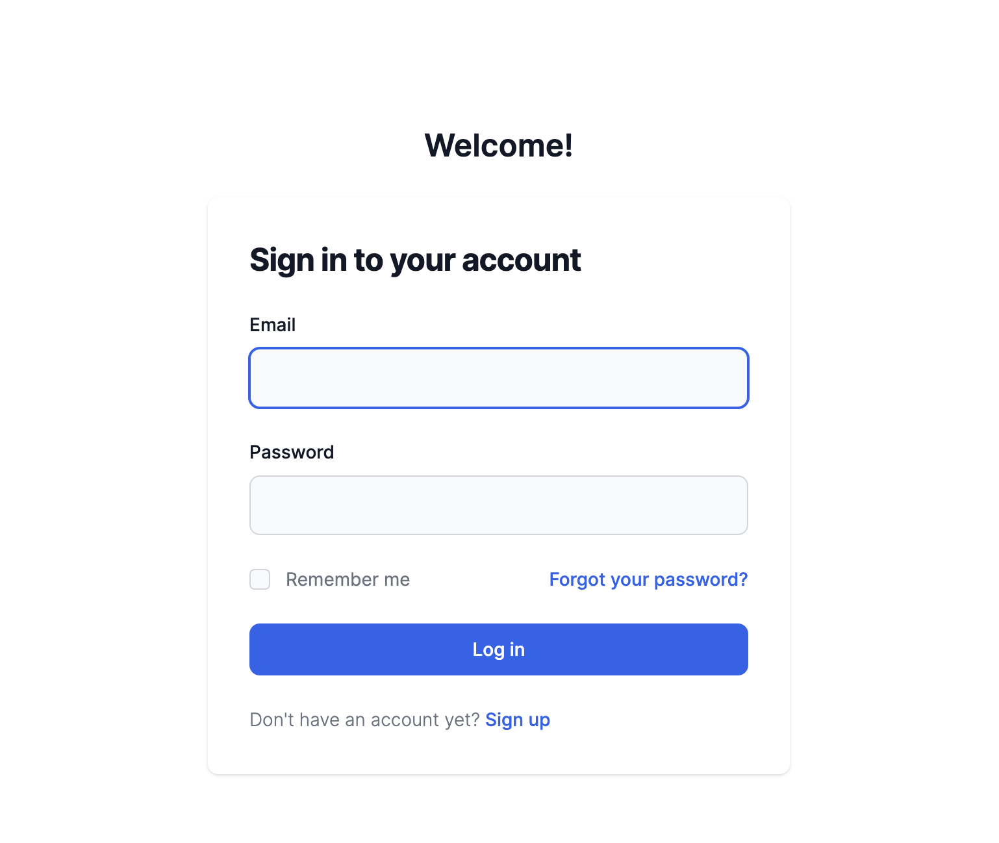
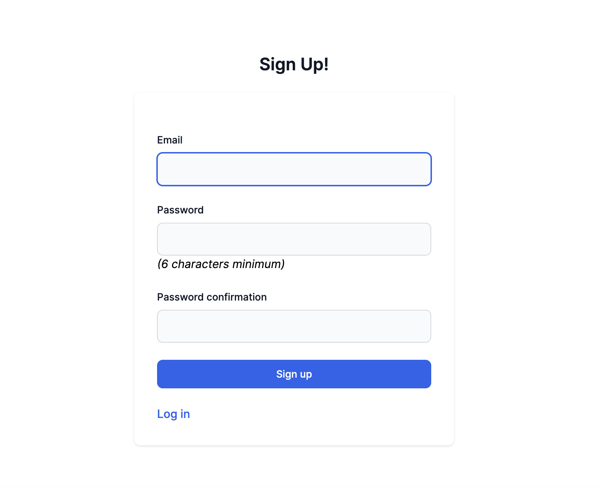
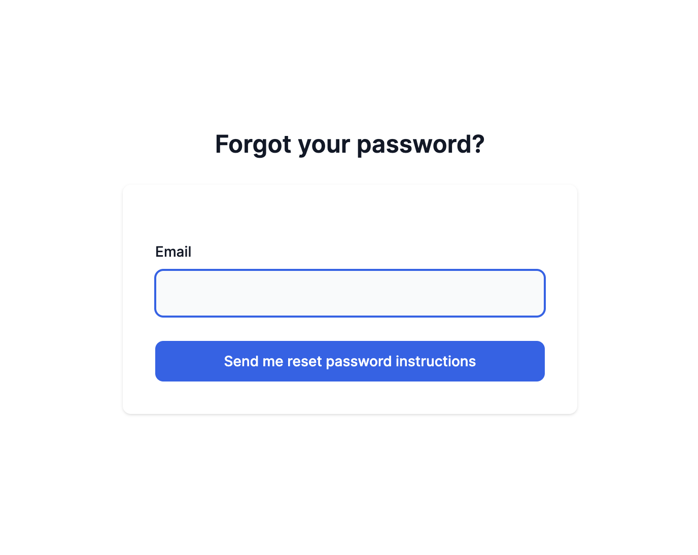
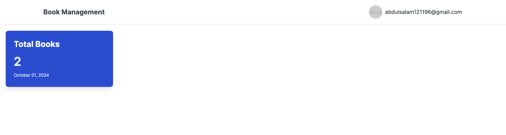
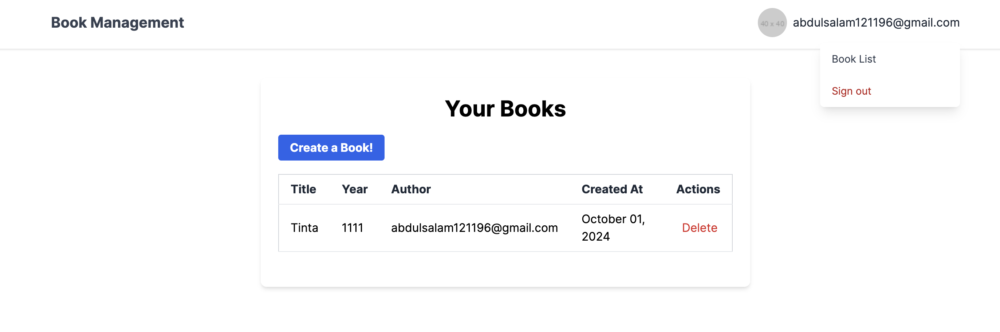
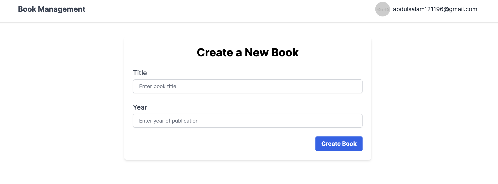

# Book Management Application

by Abdul Salam

## Project Goals

The Book Management application allows users to manage their books and authors. Each logged-in user can add books they own, where:
- One author can have multiple books.
- Each book is owned by only one author.
- All operations (viewing, creating, and deleting books) require the user to be logged in.
- When a new book is created, an email is sent to the user via a job queue system.

## Prerequisites

To run this project, ensure you have the following installed:
- **Ruby** (version as specified in the Gemfile)
- **Rails** (version as specified in the Gemfile)
- **SQLite** (for the database)
- **Redis** (for job queue management via Sidekiq)

## Libraries Used

- **Kaminari**: For pagination (`gem "kaminari"`)
- **Sidekiq**: For job queue processing and monitoring (`gem "sidekiq"`)
- **Rspec-Rails**: For testing (`gem "rspec-rails"`)
- **FactoryBot**: For test data creation (`gem "factory_bot_rails"`)
- **Rails Controller Testing**: For controller testing (`gem "rails-controller-testing"`)
- **Tailwind CSS**: As the CSS framework for styling
- **Devise**: For user authentication (`gem "devise", "~> 4.9"`)

## Installation Steps

1. Clone the repository and navigate into the project directory.

2. Install the required dependencies:
   ```bash
   bundle install
   ```

3. Set up the database by running:
   ```bash
   rails db:migrate
   ```

4. Configure the email settings in `config/environments/development.rb`. Provide your SMTP settings:
   ```ruby
   config.action_mailer.smtp_settings = {
     address: 'your_smtp_server',
     port: 587,
     domain: 'your_domain',
     user_name: 'your_email',
     password: 'your_password',
     authentication: 'plain',
     enable_starttls_auto: true
   }
   ```

5. Start the Redis server:
   ```bash
   redis-server
   ```

6. In a separate terminal, start Sidekiq to process the job queues:
   ```bash
   bundle exec sidekiq
   ```

7. Start the Rails application:
   ```bash
   rails server
   ```

## API Endpoints

Ensure that you are logged in before accessing the following endpoints:

### List all books owned by the current logged-in user:
- **Endpoint**: `/api/v1/books`
- **Method**: `GET`
- **Params**: 
  - `page`: (Optional) Navigate to a specific page of books.
  - `per_page`: (Optional) Set the number of books to display per page.

### Web URLs:
- **Login**: `/auth/login`



- **Logout**: `/auth/logout`

- **Sign Up**: `/auth/sign_up`



- **Forgot Password**: `/auth/password/new`



- **Home**: `/home`



- **Books List**: `/books`



- **Create New Book**: `/books/new`



- **Sidekiq Monitoring**: `/sidekiq`

## Running Tests

The application includes unit tests for the `BooksController` and its features. All tests use the factory pattern and are located in the `spec/` directory.

1. Ensure the Redis server is running before running tests:
   ```bash
   redis-server
   ```

2. Run the test suite using RSpec:
   ```bash
   bundle exec rspec
   ```

## Database Overview

- **Users**: Indexed by email to ensure quick lookup.
- **Authors**: Linked to users by their email (automatically indexed).
- **Books**: Each book is related to an author, with indexed authors for fast retrieval.